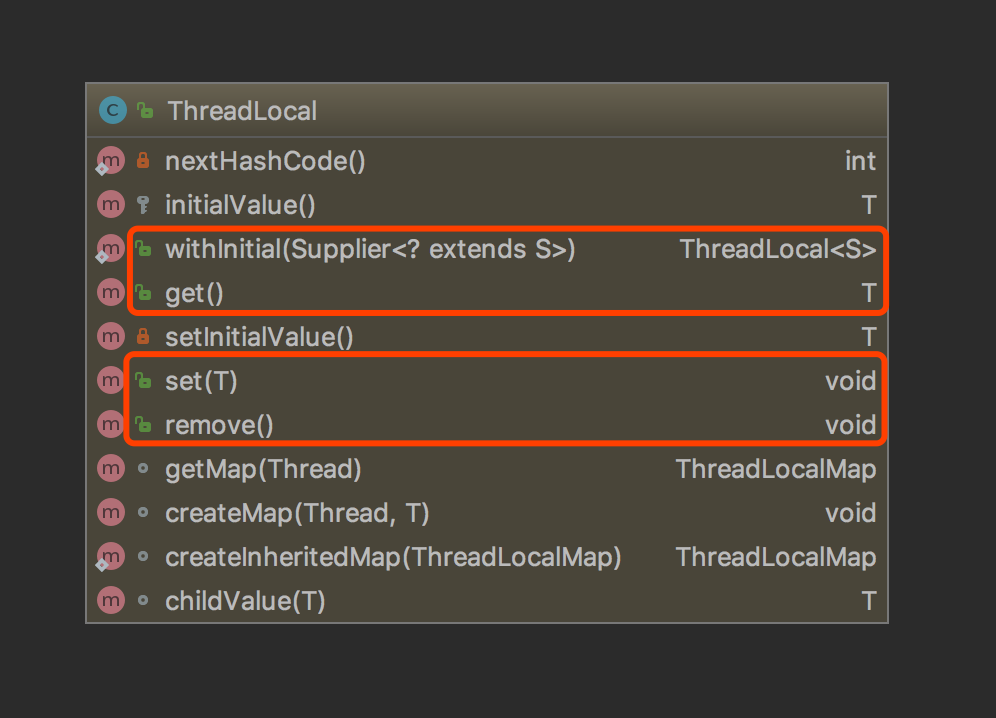

## 什么是ThreadLocal
网上关于ThreadLocal的介绍非常多，有人说ThreadLocal大家都各执己见。
下面是ThreadLocal的官方文档：
```java
/**
 * This class provides thread-local variables.  These variables differ from
 * their normal counterparts in that each thread that accesses one (via its
 * {@code get} or {@code set} method) has its own, independently initialized
 * copy of the variable.  {@code ThreadLocal} instances are typically private
 * static fields in classes that wish to associate state with a thread (e.g.,
 * a user ID or Transaction ID).
 */
```
中文翻译：ThreadLocal称为线程本地变量。在每个访问此变量的Thread中都会创建一个变量副本。ThreadLocal变量通常需要private static修饰。


## ThreadLocal使用示例
### demo1：登录用户信息处理
在以下代码中，我们模拟登录用户信息上下文设置场景，来测试ThreadLocal变量副本作用。

```java
// 用户信息
public class User {

    private Integer id;

    private String name;

    public User(Integer id, String name) {
        this.id = id;
        this.name = name;
    }

    public Integer getId() {
        return id;
    }

    public void setId(Integer id) {
        this.id = id;
    }

    public String getName() {
        return name;
    }

    public void setName(String name) {
        this.name = name;
    }

    @Override
    public String toString() {
        return "User{" +
                "id=" + id +
                ", name='" + name + '\'' +
                '}';
    }
}


// 登录用户信息上下文
public class UserContext {

    private static final ThreadLocal<User> USER_CONTEXT = new ThreadLocal<>();

    public static User getUser() {
        return USER_CONTEXT.get();
    }

    public static void setUser(User user) {
        USER_CONTEXT.set(user);
    }

    public static void remoteUser() {
        USER_CONTEXT.remove();
    }
}

public class ThreadLocalDemo {

    public static void main(String[] args) {
        // 在main线程中设置当前用户信息为user1
        User user1 = new User(1, "user1");
        UserContext.setUser(user1);
        // 打印main线程中当前用户信息，输出结果为user1
        printUser();

        Thread thread = new Thread(() -> {
            // 打印子线程中当前用户信息，输出结果为null
            printUser();

            // 在子线程中设置当前用户信息为user2
            User user2 = new User(2, "user2");
            UserContext.setUser(user2);
            // 打印子线程中当前用户信息，输出结果为user2
            printUser();
        });
        thread.start();

        // 再打印main线程中当前用户信息，输出结果仍是user1
        printUser();
    }

    public static void printUser() {
        System.out.println("thread[" + Thread.currentThread().getName() + "] user:" + UserContext.getUser());
    }
}
```
运行结果：
```text
thread[main] user:User{id=1, name='user1'}
thread[Thread-0] user:null
thread[Thread-0] user:User{id=2, name='user2'}
thread[main] user:User{id=1, name='user1'}
```

实际项目中，通常是在拦截器中设置登录用户信息上下文，请求处理之前，根据token获取用户信息并调用UserContext.serUser()，请求处理结束，调用UserContext.removeUser()删除当前登录用户上下文


### demo2：ThreadLocal初始化
```java
public class ThreadLocalDemo2 {

    // 第1种方法，重写initialValue()方法
    private static final ThreadLocal<User> USER_CONTEXT1 = new ThreadLocal(){
        @Override
        protected Object initialValue() {
            return new User(1, "user1");
        }
    };

    // 第2种方法，调用ThreadLocal中withInitial()静态方法
    private static final ThreadLocal<User> USER_CONTEXT2 = ThreadLocal.withInitial(() -> new User(1, "user1"));

    public static void main(String[] args) {
        System.out.println(ThreadLocalDemo2.USER_CONTEXT1.get());
        System.out.println(ThreadLocalDemo2.USER_CONTEXT2.get());
    }
}
```
运行结果：
```text
User{id=1, name='user1'}
User{id=1, name='user1'}
```


## ThreadLocal源码分析
在每个Thread内部都有一个ThreadLocalMap，存储当前Thread所有的ThreadLocal变量副本
```java
package java.lang;

public class Thread implements Runnable {
    /*
     * InheritableThreadLocal values pertaining to this thread. This map is
     * maintained by the InheritableThreadLocal class.
     */
    ThreadLocal.ThreadLocalMap threadLocals = null;
}
```
ThreadLocalMap定义在ThreadLocal中，可暂时理解为它是一个HashMap，key是ThreadLocal对象，value是线程变量副本
```java
package java.lang;

public class ThreadLocal<T> {
    static class ThreadLocalMap {
        ThreadLocalMap(ThreadLocal<?> firstKey, Object firstValue) {
            // ...
        }
    }
}
```
ThreadLocal是Thread中ThreadLocalMap的管理者。对于ThreadLocal的set()、get()、remove()的操作结果，都是针对当前Thread中的ThreadLocalMap进行存储、获取、删除操作。



具体分析看以下代码：
```java
package java.lang;

public class ThreadLocal<T> {
    /**
     * 线程本地变量的初始值
     * 1.只有在第一次调用get()方法时，才会调用此方法并设置初始值
     * 2.如果直接调用set()方法，此方法不会被调用
     * 3.如果调用remove()之后，再次调用get()方法时，会再次调用该方法
     *
     * 如果需要初始值，一般情况下使用匿名子类重写此方法，建议使用ThreadLocal.withInitial()创建子类
     */
    protected T initialValue() {
        return null;
    }

    /**
     * 获取当前线程的变量副本值
     */
    public T get() {
        // 获取当前线程的ThreadLocalMap
        Thread t = Thread.currentThread();
        ThreadLocalMap map = getMap(t);
        // 如果ThreadLocalMap已经初始化，并且ThreadLocalMap中存在变量副本，则返回变量副本
        if (map != null) {
            ThreadLocalMap.Entry e = map.getEntry(this);
            if (e != null) {
                @SuppressWarnings("unchecked")
                T result = (T)e.value;
                return result;
            }
        }
        // 否则，设置并返回变量副本初始值
        return setInitialValue();
    }

    /**
     * 设置当前线程的变量副本初始值
     * 通过覆盖initialValue方法可设置初始值
     */
    private T setInitialValue() {
        T value = initialValue();
        Thread t = Thread.currentThread();
        ThreadLocalMap map = getMap(t);
        if (map != null)
            map.set(this, value);
        else
            createMap(t, value);
        return value;
    }

    /**
     * 设置当前线程的变量副本值
     */
    public void set(T value) {
        // 获取当前线程的ThreadLocalMap
        Thread t = Thread.currentThread();
        ThreadLocalMap map = getMap(t);
        if (map != null)
            // 如果ThreadLocalMap已经初始化，设置变量副本值
            map.set(this, value);
        else
            // 否则，创建当前线程的ThreadLocalMap，并设置变量副本值为value
            createMap(t, value);
    }

    /**
     * 删除当前线程的变量副本值
     */
    public void remove() {
        ThreadLocalMap m = getMap(Thread.currentThread());
        if (m != null)
            m.remove(this);
    }

    /**
     * 获取指定线程的ThreadLocalMap
     * 此方法是包私有的
     *
     * @param  t the current thread
     * @return the map
     */
    ThreadLocalMap getMap(Thread t) {
        return t.threadLocals;
    }

    /**
     * 创建指定线程的ThreadLocalMap，并设置初始值firstValue
     * 此方法是包私有的
     */
    void createMap(Thread t, T firstValue) {
        t.threadLocals = new ThreadLocalMap(this, firstValue);
    }
}
```
注意：ThreadLocal中可以直接调用`t.threadLocals`是因为Thread与ThreadLocal在同一个包下，同样Thread可以直接访问`ThreadLocal.ThreadLocalMap threadLocals = null;`来进行声明属性。


## ThreadLocalMap源码分析
** 占位 ** 


## 线程上下文传递
### demo3：使用InheritableThreadLocal传递线程上下文
在上面的登录用户信息demo中，虽然main线程和子线程中变量副本值是不一样的。但在实际开发场景中，我们总是需要将父线程中上下文信息传递到子线程中进行使用。
对于以上问题，使用InheritableThreadLocal可以轻松解决，只需要将ThreadLocal替换为InheritableThreadLocal，我们对上面的代码进行改造：

```java
public class InheritableUserContext {

    private static final ThreadLocal<User> USER_CONTEXT = new InheritableThreadLocal<>();

    public static User getUser() {
        return USER_CONTEXT.get();
    }

    public static void setUser(User user) {
        USER_CONTEXT.set(user);
    }

    public static void remoteUser() {
        USER_CONTEXT.remove();
    }
}

public class ThreadLocalDemo3 {

    public static void main(String[] args) {
        // 在main线程中设置当前用户信息为user1
        User user1 = new User(1, "user1");
        InheritableUserContext.setUser(user1);
        // 打印main线程中当前用户信息，输出结果为user1
        printUser();

        Thread thread = new Thread(() -> {
            // 打印子线程中当前用户信息，输出结果为null
            printUser();

            Thread thread1 = new Thread(() -> {
                printUser();
            });
            thread1.start();
        });
        thread.start();
    }

    public static void printUser() {
        System.out.println("thread[" + Thread.currentThread().getName() + "] user:" + InheritableUserContext.getUser());
    }
}
```
执行结果：
```text
thread[main] user:User{id=1, name='user1'}
thread[Thread-0] user:User{id=1, name='user1'}
thread[Thread-1] user:User{id=1, name='user1'}
```

### InheritableThreadLocal源码分析
InheritableThreadLocal继承自ThreadLocal，并重写了父类三个方法，不同于ThreadLocal，InheritableThreadLocal变量存放在Thread.inheritableThreadLocals而不是Thread.threadLocals中：
```java
public class InheritableThreadLocal<T> extends ThreadLocal<T> {
    protected T childValue(T parentValue) {
        return parentValue;
    }

    ThreadLocalMap getMap(Thread t) {
       return t.inheritableThreadLocals;
    }

    void createMap(Thread t, T firstValue) {
        t.inheritableThreadLocals = new ThreadLocalMap(this, firstValue);
    }
}
```

在new一个线程时，init()方法中会复制parent线程（当前调用线程）中的inheritableThreadLocals到新创建线程中
```java
public class Thread implements Runnable {
    
    ThreadLocal.ThreadLocalMap inheritableThreadLocals = null;
    
    public Thread() {
        init(null, null, "Thread-" + nextThreadNum(), 0);
    }
    
    private void init(ThreadGroup g, Runnable target, String name,
                      long stackSize) {
        init(g, target, name, stackSize, null, true);
    }
    
    
    private void init(ThreadGroup g, Runnable target, String name,
                          long stackSize, AccessControlContext acc,
                          boolean inheritThreadLocals) {
        // 继承父线程中的inheritableThreadLocals
        if (inheritThreadLocals && parent.inheritableThreadLocals != null)
            this.inheritableThreadLocals =
                ThreadLocal.createInheritedMap(parent.inheritableThreadLocals);
    }
}

```

ThreadLocal也为Thread.inheritableThreadLocals复制提供了相应的接口：
```java
public class ThreadLocal<T> {
    
    static ThreadLocalMap createInheritedMap(ThreadLocalMap parentMap) {
        return new ThreadLocalMap(parentMap);
    }
    
    static class ThreadLocalMap {
        private ThreadLocalMap(ThreadLocalMap parentMap) {
            // ...
        }
    }
}
```

### demo4：实际项目中的上下文传递
在实际应用场景里，一般都会使用线程池进行多线程编程，线程池中的线程会反复使用，应用需要的是把任务提交给线程池时的ThreadLocal传递给任务执行。
在线程池中运行一个Runnable实例并不会新建一个线程，而是把Runnable实例添加到任务队列中（在核心线程全部在处理任务的情况），
让ThreadPoolExecutor的worker从队列里拿出Runnable实例，然后运行Runnable实例的run()方法。
这时，父子线程的ThreadLocal传递已经没有意义，jdk提供的InheritableThreadLocal没办法使用。下面我们就看一下在线程池中怎么进行上下文传递：


假设我们的调用链通过TraceContext类来保存上下文信息
```java
public class TraceContext {

    private static final ThreadLocal<Object> CONTEXT = new ThreadLocal<>();

    public static Object getContext() {
        return CONTEXT.get();
    }
    public static void setContext(Object obj) {
        CONTEXT.set(obj);
    }
    public static void removeContext() {
        CONTEXT.remove();
    }
}
```

先定义2个类TraceRunnable和TraceCallable，分别继承自Runnable和Callable，目的在于初始化Runnable和Callable实例时保存调用线程的上下文信息，
在执行run()或者call()方法时，先把调用线程的上下文信息设置到当前执行的线程中，run()/call()方法执行后恢复执行线程的上下文

```java
public class TraceRunnable implements Runnable {

    //在初始化TraceRunnable时会获取调用线程的上下文
    private final Object context = TraceContext.getContext();

    private final Runnable runnable;

    public TraceRunnable(Runnable runnable) {
        this.runnable = runnable;
    }

    @Override
    public void run() {
        Object backup = TraceContextUtil.backupAndSet(this.context);

        try {
            this.runnable.run();
        } finally {
            TraceContextUtil.restoreBackup(backup);
        }
    }

    public Runnable getRunnable() {
        return this.runnable;
    }

    public static TraceRunnable get(Runnable runnable) {
        if (runnable == null) {
            return null;
        } else {
            return runnable instanceof TraceRunnable ? (TraceRunnable)runnable : new TraceRunnable(runnable);
        }
    }
}

public class TraceCallable<V> implements Callable<V> {

    //在初始化TraceCallable时会获取调用线程的上下文
    private final Object context = TraceContext.getContext();

    private final Callable<V> callable;

    public TraceCallable(Callable<V> callable) {
        this.callable = callable;
    }

    @Override
    public V call() throws Exception {
        Object backup = TraceContextUtil.backupAndSet(this.context);

        V result;
        try {
            result = this.callable.call();
        } finally {
            TraceContextUtil.restoreBackup(backup);
        }

        return result;
    }

    public Callable<V> getCallable() {
        return this.callable;
    }

    //返回TraceCallable实例
    public static <T> TraceCallable<T> get(Callable<T> callable) {
        if (callable == null) {
            return null;
        } else {
            return callable instanceof TraceCallable ? (TraceCallable)callable : new TraceCallable<>(callable);
        }
    }
}


public class TraceContextUtil {

    //设置调用线程的上下文到当前执行线程中,并返回执行线程之前的上下文
    public static Object backupAndSet(Object currentContext) {
        Object backupContext = TraceContext.getContext();
        TraceContext.setContext(currentContext);
        return backupContext;
    }

    //恢复执行线程的上下文
    public static void restoreBackup(Object backup) {
        TraceContext.setContext(backup);
    }
}
```

接下来，我们在线程池中执行TraceRunnble和TraceCallable实现上下文传递：
```java
public class ThreadLocalDemo {

    public static void main(String[] args) throws ExecutionException, InterruptedException {
        ExecutorService threadPool = Executors.newFixedThreadPool(4);

        TraceContext.setContext("0123456789");

        for (int i = 0; i < 5; i++) {
            threadPool.execute(TraceRunnable.get(() -> {
                printContext();
            }));

            Future<Integer> task = threadPool.submit(TraceCallable.get(() -> {
                printContext();
                return 1;
            }));
            task.get();
        }

        threadPool.shutdown();
    }


    public static void printContext() {
        System.out.println("thread[" + Thread.currentThread().getName() + "] context: " + TraceContext.getContext());
    }
}
```
执行结果：
```text
thread[pool-1-thread-1] context: 0123456789
thread[pool-1-thread-2] context: 0123456789
thread[pool-1-thread-3] context: 0123456789
thread[pool-1-thread-4] context: 0123456789
thread[pool-1-thread-1] context: 0123456789
thread[pool-1-thread-2] context: 0123456789
thread[pool-1-thread-3] context: 0123456789
thread[pool-1-thread-4] context: 0123456789
thread[pool-1-thread-1] context: 0123456789
thread[pool-1-thread-2] context: 0123456789
```
在分布式系统中，需要传递的信息一般包括traceID、 spanID以及部分请求参数等。就可以使用这种方式进行上下文传递。


参考文章：
* <https://blog.csdn.net/zhuzj12345/article/details/84333765>
* <https://www.ezlippi.com/blog/2019/05/trace-context-bwtween-threads.html>
